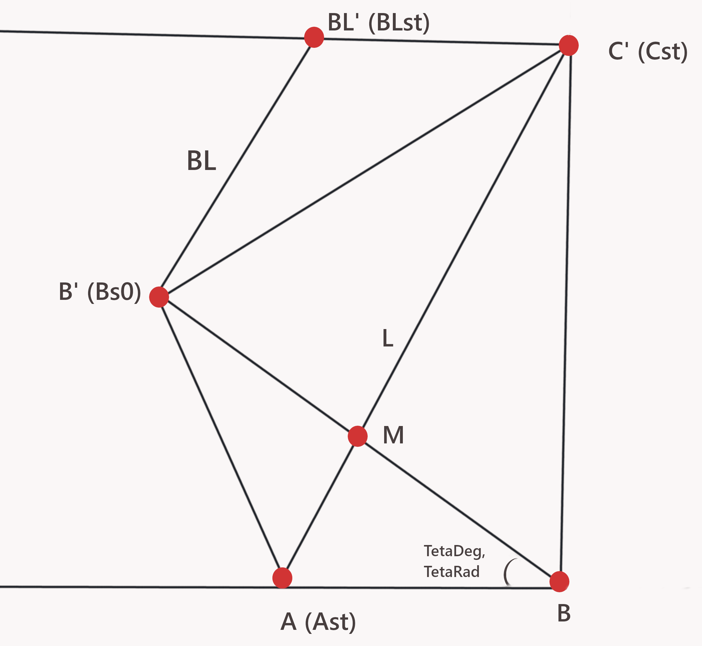

# Визуальный просмотрщик с эффектом перелистывания (Avalonia)
 

Описание
----------
Проект демонстрирует механизм перелистывания страниц с отображением «загнутого» угла. Две реализации: через кастомный контрол (PageFlipControl) и через рендер в ViewModel + Canvas (CanvasBasedView). По умолчанию загружены примеры из Assets (avares-ресурсы); можно выбрать локальную папку с изображениями (.png/.jpg).

## Структура проекта
- App.axaml / App.axaml.cs — запуск приложения.
- Assets/
  - images — примеры изображений (avares-ресурсы).
- Controls/
  - PageFlipControl.cs — кастомный контрол; отрисовка в public override void Render.
- Corner/
  - CornerModel.cs — геометрия сгиба, расчёт точек, отрисовка страниц/тени/градиентов.
- ImageStore.cs — поиск и загрузка изображений, простое кэширование Bitmap.
- ViewModels/
  - CanvasBasedViewModel.cs — Canvas/RenderTargetBitmap реализация.
  - MainViewModel.cs — обёртка для PageFlipControl.
  - MainWindowViewModel.cs — переключение режимов, команды, выбор папки, размеры окна.
- Views/
  - CanvasBasedView.axaml / .axaml.cs — Canvas-режим.
  - MainView.axaml / .axaml.cs — режим с PageFlipControl.
  - MainWindow.axaml / .axaml.cs — главное окно и шаблоны DataTemplate.

## Быстрый старт (пользователю)
- Запустить приложение.
- По умолчанию загружены изображения: avares://PageFlip/Assets/images/.
- Кнопка "Выберите папку" — выбрать локальную папку с изображениями (.png/.jpg).
- Листать вперёд: перетащить правый нижний угол (область ~100×100 px).
- Листать назад: кликнуть или перетащить левый нижний угол вправо.
- Переключение подходов: кнопки ← / → в верхней панели переключают PageFlipControl <-> CanvasBasedView.

## Архитектура и назначение модулей
- MainWindowViewModel
  - Управление режимами, командами (Back/Forward/PickFolder), размерами окна, делегирование FolderPath дочерним VM.
- MainViewModel / CanvasBasedViewModel (наследуют ViewModelBase)
  - MainViewModel: минимальная обёртка для PageFlipControl (FolderPath).
  - CanvasBasedViewModel: рендерит в RenderTargetBitmap и предоставляет результат как ImageBrush/Bitmap для View.
- PageFlipControl
  - Контрол инкапсулирует логику указателей и весь рендер (Render/DrawingContext). Подходит для повторного использования в XAML.
- CornerModel
  - Геометрические вычисления: точки нажатия, линия сгиба L (перпендикуляр к BB' через середину), точки пересечений (Ast, Cst, Bast и т.д.), угол поворота (_teta), и функция PagesRender — отрисовка страниц, сгиба, теней и бликов.
- ImageStore
  - Поиск изображений в локальной папке или avares-ресурсе, загрузка Bitmap, простое кэширование (можно заменить на LRU).

## Геометрия
 

- Точка A' — пересечение L с верхней стороны AB (y = h). 
- _teta — угол поворота
- L - линия сгиба
- BL - перпендикуляр к MB  в точке B' 
- BL' - точка пересечения BL с верхом

При  сгибания листа точка B переходит в B' и образуется линия сгиба L, которая проходит через середину M сегмента BB' и перпендикулярна BB'. 

Эквивалентные названия в коде : 
A' => Ast, _Ast;
B' => _Bs0;
M => _M;
BL' => BLst 

## Технические детали
- Система координат — прямоугольная, края страницы параллельны осям.
- Гибкость страницы не моделируется: отображается жёсткий загиб угла.
- Буфер страниц: prev, current, next, nextNext (_selImages[4]). Перелистывание вперёд сдвигает буфер и увеличивает _pImgIndex на 2.
- Рендер: RenderTargetBitmap, DrawingContext.DrawImage, RotateTransform, StreamGeometry (клипы/трапеции). Градиенты рисуются вдоль линии сгиба.
- Масштаб/обрезка: ResizeCoverCropTopRight сохраняет пропорции и обрезает сверху/справа.
- События: PointerPressed / PointerMoved / PointerReleased + pointer capture.

## Преимущества
- Два рабочих подхода рендеринга — гибкость для разных сценариев:
  - PageFlipControl: инкапсуляция и простота повторного использования.
  - Canvas-based: удобство тестирования, постобработки и получения RenderTargetBitmap.
- Поддержка avares-ресурсов и локальных файлов.
- Корректная геометрическая модель сгиба (CornerModel) с тенями и бликами.
- Простое кэширование для снижения IO.
- Чёткое разделение ответственности (View / ViewModel / Control / Model).
- Учёт RenderScaling / PixelSize.

## Перспективы развития
- LRU-кеш в ImageStore и предзагрузка соседних страниц.
- Поддержка произвольных соотношений сторон и страниц разного размера.
- «Мягкая» деформация страницы (физическая модель для реалистичного сгиба).
- Автоматическая анимация завершения перелистывания (добросить/вернуть страницу по инерции).
- Поддержка жестов (touch), inertia и скоростного перелистывания.
- Экспорт анимаций (GIF/видео) через последовательность RenderTargetBitmap.
- Вынесение градиентов/геометрии в XAML (ControlTemplate/GeometryDrawing) и биндинг свойств для стилизации.
- Поддержка PDF/мультистраничных документов, разных форматов.

Замечание. При необходимости можно перенести регионы, градиенты и графические объекты из PageFlipControl.cs::PagesRender в XAML и привязать свойства (Points, Clip, GradientStops и т.д.). Это даст более декларативную настройку внешнего вида, но итоговый визуальный результат останется тем же — выбор между удобством стилизации (XAML) и прямым управлением/производительностью (C#).

## Где смотреть в коде
- Corner/CornerModel.cs — расчёт линии сгиба и PagesRender.
- Controls/PageFlipControl.cs — custom control с Render override.
- ViewModels/CanvasBasedViewModel.cs — рендер в VM (RenderTargetBitmap).
- ImageStore.cs — загрузка/кеширование изображений.
- Views/MainWindow.axaml(.cs) и ViewModels/MainWindowViewModel.cs — переключение режимов и выбор папки.

## Быстрый старт для разработчика
1. Клонировать репозиторий.
2. Открыть в IDE (Visual Studio / Rider) — проект Avalonia (.NET 8+).
3. Запустить приложение.
4. Тестировать оба режима, выбрать локальную папку с изображениями, пробовать перелистывание.
